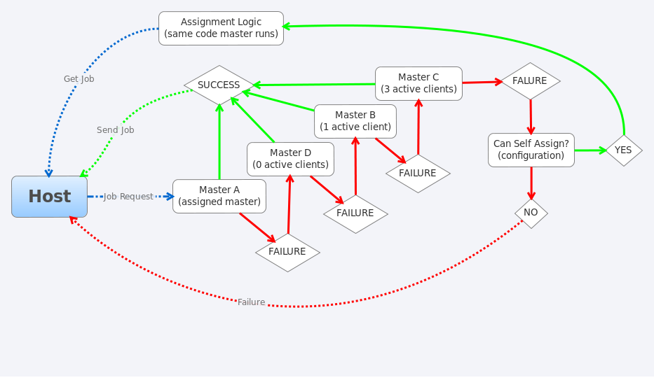

.. This file is part of PyFarm.
.. Copyright (C) 2008-2013 Oliver Palmer
..
.. PyFarm is free software: you can redistribute it and/or modify
.. it under the terms of the GNU Lesser General Public License as published by
.. the Free Software Foundation, either version 3 of the License, or
.. at your option, any later version.
..
.. PyFarm is distributed in the hope that it will be useful,
.. but WITHOUT ANY WARRANTY; without even the implied warranty of
.. MERCHANTABILITY or FITNESS FOR A PARTICULAR PURPOSE.  See the
.. GNU Lesser General Public License for more details.
..
.. You should have received a copy of the GNU Lesser General Public License
.. along with PyFarm.  If not, see <http://www.gnu.org/licenses/>.

.. _design-client-server_fallback_behaviors:

Client<->Server Assignment Fallback Behaviors
=============================================
This document describes the process the client should attempt after failing to
contact one or more masters for a new task assignment.  It is intended to
describe the expected behavior(s) when certain failure conditions are met,
when a host is allowed to make decisions for itself, what limits these
decisions, and when control is given back to a master.

.. seealso::
    see :ref:`DNS Resource Resolution <design-dns_resource_resolution>` for
    information on name resolution

Fallback Conditions
-------------------
Depending on the available master(s) and the configuration how the agent will
fallback can vary.

Generally speaking each agent should:
    * ask DNS to resolve the master hostname alias (ex. pyfarm-master)
    * on failure contact DNS again till we exhaust all master addresses
      before falling back to self assignment (if enabled in the configuration)

Failure Logging
---------------
Any failure status should be reported back to the custom DNS REST api so future
queries won't return a failed host again.  The agent's concept of what
constitutes a failure should include either a failure to connect or a failure
to retrieve the information requested (busy signal).

Completion of Assigned Task
---------------------------
Upon completion of an assigned task the host will continue operating
normally by requesting a new task from a master.  If however the host is
operating in a failed state that forced it to decide on its own assignments it
may continue to do so if the configuration file dictates this behavior.  In all
other cases we either:
    * attempt to recontact a master for each new job request or at a scheduled
      interval (configuration controlled [type of contact, interval])
    * never revert to standard behavior once in autonomous assignment mode
      unless contacted by the server or directed via the api (enabled via config)

Improvements Over Previous Design
---------------------------------
Single Master
+++++++++++++
* lower overall failure rate for job assignment and master communication
* masters can be rotated in and out of the pool
* fully relies on DNS name resolution instead of an explict address/name

Pure Self Assignment
++++++++++++++++++++
* more centralized management of the client pool
* more advanced logic can be performed on a master's end based on direct
  information from a host or group of hosts
* client/master share most of the same logic necessary to select jobs
