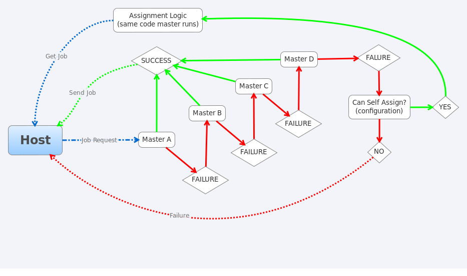

.. This file is part of PyFarm.
.. Copyright (C) 2008-2013 Oliver Palmer
..
.. PyFarm is free software: you can redistribute it and/or modify
.. it under the terms of the GNU Lesser General Public License as published by
.. the Free Software Foundation, either version 3 of the License, or
.. at your option, any later version.
..
.. PyFarm is distributed in the hope that it will be useful,
.. but WITHOUT ANY WARRANTY; without even the implied warranty of
.. MERCHANTABILITY or FITNESS FOR A PARTICULAR PURPOSE.  See the
.. GNU Lesser General Public License for more details.
..
.. You should have received a copy of the GNU Lesser General Public License
.. along with PyFarm.  If not, see <http://www.gnu.org/licenses/>.

.. warning::
    changes to this document are ongoing and may not reflect the final design

Client<->Server Assignment Fallback Behaviors
=============================================

This document describes the process the client should attempt after failing to
contact one more masters for a new task assignment.  It is intended to describe
the expected behavior(s) when certain failure conditions are met, when a host
is allowed to make decisions for itself, what limits these decisions, and when
control is given back to the master.

Fallback Conditions
-------------------
Depending on the available hosts, the assigned master, and the configuration
how the host will fall back can vary.  Generally speaking each host will:
    * attempt to use the assigned master
    * attempt each other master ordered by the number of hosts assigned to
      the master
    * if configured fall back onto using the logic each master runs or if not
      configured fail any assignment (schedule above for reattempt)

**NOTE**: Selection of each master will likely be a via a dns round robin
setup.  Written in twisted for the purpose of resolving internal or aliased
names.

Failure Logging
---------------
Any failure status for each host should be logged into a table containing
the time of the failure, host making the request, the master the request
was made to, and possibly the type of request made.  Types of request could
include:
    * number of failed attempts to contact and use a master
    * number of 'rejected' requests to get a task

Completion of Assigned Task
---------------------------
Upon completion of an assigned task the host will continue operating
normally by requesting a new task from the master.  If however the host is
operating in a failed state that forced it to decide on its own assignments it
may continue to do so if the configuration file dictate this behavior.  In all
other cases we either either:
    * attempt to recontact the master for each new job request or at a scheduled
      interval (configuration controlled [type of contact, interval])
    * never revert to standard behavior once in autonomous assignment mode
      unless contacted by the server or directed via the api (enabled via config)

Advantages Over Other Options
-----------------------------
Single Master
+++++++++++++
* lower overall failure rate for job assignments from a master
* masters can be rotated in and out of the pool

Pure Self Assignment
++++++++++++++++++++
* more centralized management of the client pool
* more advanced logic can be performed server side based on direct information
  from a host
* client/server share most of the same logic necessary to select jobs

Disadvantages Over Other Options
--------------------------------
Single Master
+++++++++++++
* possible currency issues between host information, information residing
  in ram, and remote databases when operating at scale
* more management overhead

Pure Self Assignment
++++++++++++++++++++
* more complex logic
* implementation will be more difficult to understand